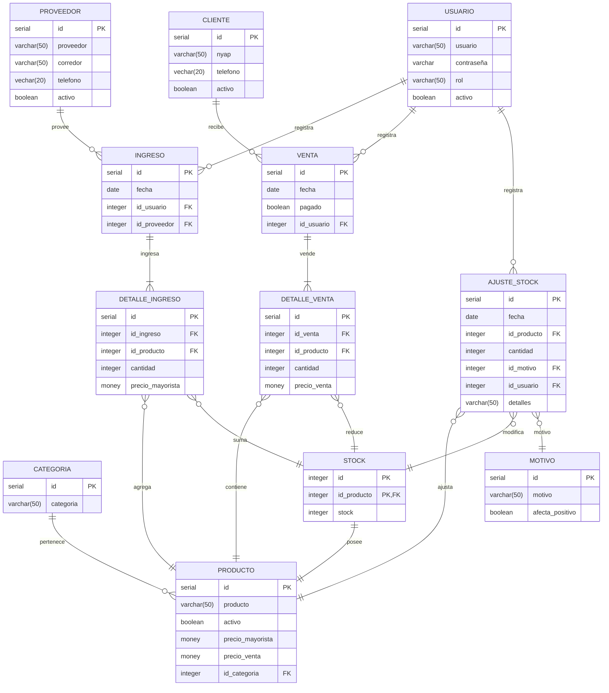

<!--
    USUARIO ||--o{ PEDIDO : "realiza"
    PEDIDO ||--|{ LINEA_PEDIDO : "contiene"
    PRODUCTO ||--o{ LINEA_PEDIDO : "aparece en"

     \|\|--\|\|	Uno a uno
    \|\|--o{	Uno a muchos
    }o--o{	Muchos a muchos
    \|\|--o\|	Uno a cero o uno

    o: opcional
    | obligatoria -->
